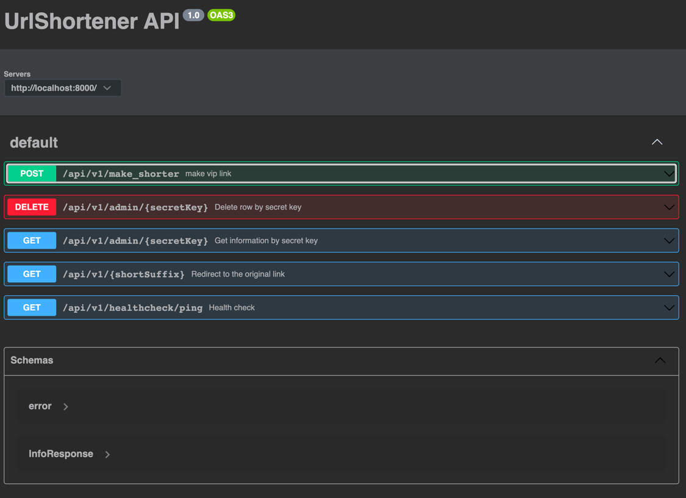
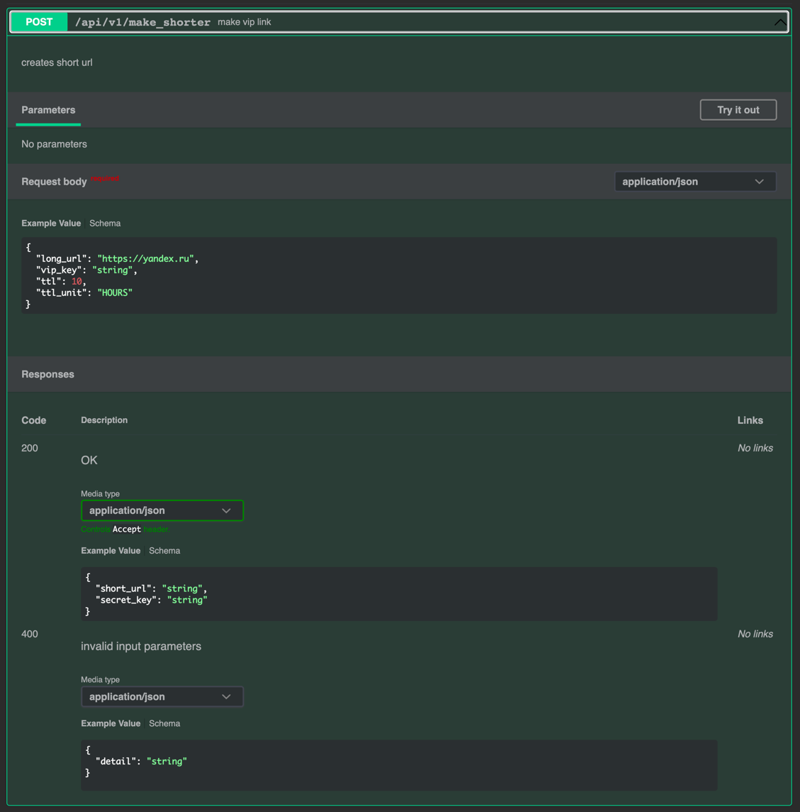
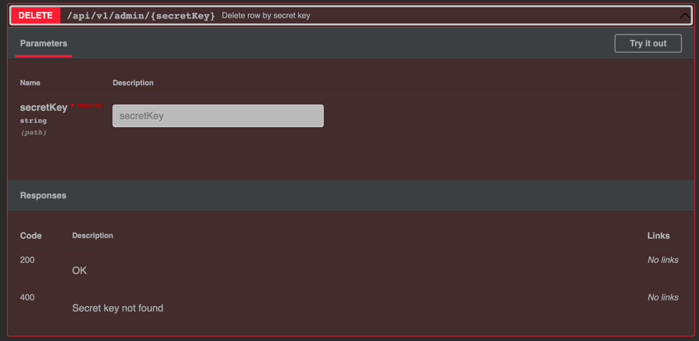
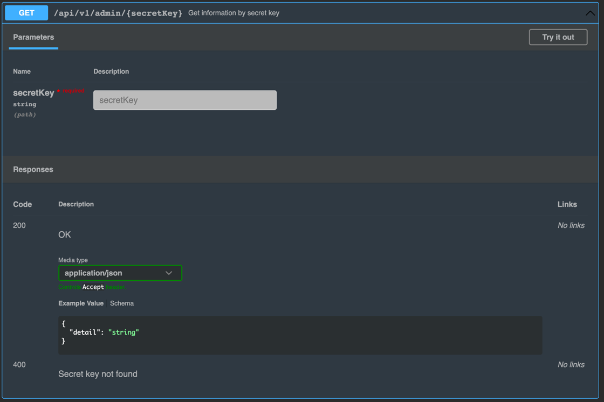
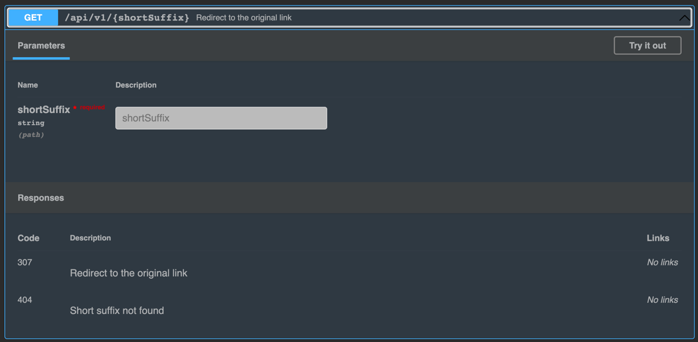
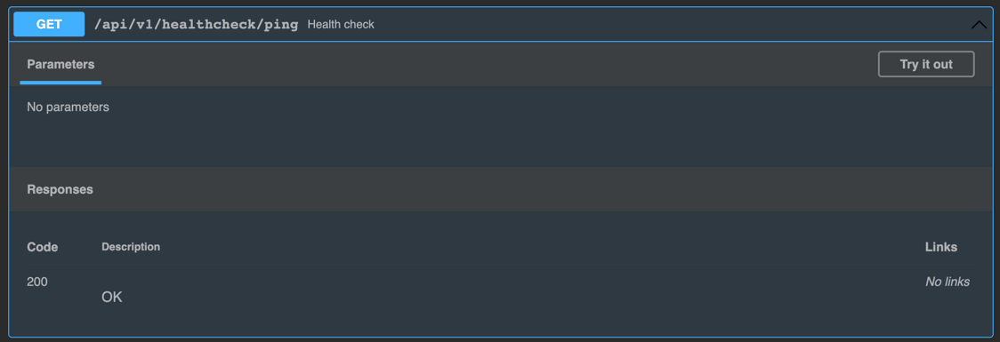
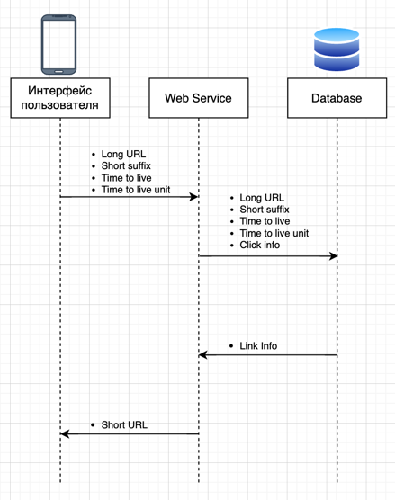

# Vip urls

## Идея
Идея проекта заключается в создании сервиса сокращения URL-адресов с возможностью предоставления VIP-ссылок. VIP-ссылки
позволяют пользователям создавать сокращенные ссылки, для более удобного использования и распространения, также позволяют
следить за количеством перехода по этим ссылкам.

## Продуктовые гипотезы
1. Если предоставлять ссылки с более удобным форматом VIP-ссылок, то ожидается, что пользователи будут чаще использовать
   эти ссылки, потому что Vip ссылки предоставляются в более коротком и запоминающемся формате, что облегчает пользователю
   запоминание и обмен ссылками.
2. Если отслеживать метрики со взаимодействием Vip-ссылок, то ожидается, что аналитики и маркетологи будут иметь больше
   информации о поведении пользователей и на основе этих данных смогут принимать более эффективные решения, потому что
   отслеживание метрик обеспечивает аналитическую осведомленность, что позволяет принимать информированные решения.

## Оценка трудозатрат (описывается с точки зрения учебного проекта)
1. **Анализ требований и проектирование**: оценивается на 3 часа работы, включая определение функциональных требований,
   перепроектирование БД и пересмотр архитектуры системы.
2. **Разработка серверной части**: оценивается на 10 часов работы, включая реализацию для хранения и управление ссылками
   в БД, а также реализацию доступа к VIP-ссылкам и отслеживания время жизни ссылки.
3. **Тестирование и отладка**: оценивается на 10 часов работы, включая проверку на краевые случаи и время на исправление
   выявленных ошибок

## Описание MVP
Придумать, можно ли сделать MVP, если да, то как он будет выглядеть и сколько это займет времени;
В качестве MVP, я думаю лучше будет использовать ботов в мессенджерах таких как телеграм или вк, которые будут подключены
к уже написанному бэкенду, благодаря тому, что будут использоваться мессенджеры, нет необходимости писать фронт-енд часть,
что экономит ресурсы при создании MVP. Главный ресурс-время, будет потрачено лишь на изучение API телеграмма или вконтакте,
для разработки ботов, что оценивается примерно в 30-40 часов рабочего времени.

## Описание архитектуры
Проработать архитектуру и описать ее в тексте (в качестве формального описания подойдут OpenAPI описание, диаграммы классов,
компонентные диаграммы и др. - в зависимости от того, что лучше отразит суть изменений и, что будет понятнее проверяющему);
> Структура ручек в OpenApi

> Метод Post, который сокращает ссылки

> Метод Delete для удаления ссылки по секретному ключу

> Метод Get для просмотра информации о ссылке

> Метод Get для перехода по Vip ссылке

> Метод Get для проверки работаспособности сервера

> Описание в api в формате openapi.yaml
~~~yaml
openapi: "3.0.2"
info:
  title: UrlShortener API
  version: "1.0"
servers:
  - url: http://localhost:8000/
components:
  schemas:
    error:
      type: object
      properties:
        detail:
          description: error message
          type: string
          required: true
    InfoResponse:
      type: object
      properties:
        detail:
          description: object message
          type: string
          required: true
paths:
  /api/v1/make_shorter:
    post:
      summary: make vip link
      description: creates short url
      requestBody:
        required: true
        content:
          application/json:
            schema:
              type: object
              properties:
                long_url:
                  description: url to make shorter
                  type: string
                  default: https://yandex.ru
                vip_key:
                  description: short key to be mapped to long url
                  type: string
                  required: false
                ttl:
                  description: |
                    number of time-units this short url is going to be active. 
                    Maximum value must not be more than 48 hours
                  type: integer
                  required: false
                  default: 10
                ttl_unit:
                  description: time unit for time_to_live parameter
                  type: string
                  enum:
                    - SECONDS
                    - MINUTES
                    - HOURS
                    - DAYS
                  required: false
                  default: HOURS
      responses:
        '200':
          description: OK
          content:
            application/json:
              schema:
                type: object
                properties:
                  short_url:
                    type: string
                  secret_key:
                    type: string
        '400':
          description: invalid input parameters
          content:
            application/json:
              schema:
                $ref: "#/components/schemas/error"
  /api/v1/admin/{secretKey}:
    delete:
      summary: Delete row by secret key
      parameters:
        - name: secretKey
          in: path
          required: true
          schema:
            type: string
      responses:
        '200':
          description: OK
        '400':
          description: Secret key not found
    get:
      summary: Get information by secret key
      parameters:
        - name: secretKey
          in: path
          required: true
          schema:
            type: string
      responses:
        '200':
          description: OK
          content:
            application/json:
              schema:
                $ref: '#/components/schemas/InfoResponse'
        '400':
          description: Secret key not found
  /api/v1/{shortSuffix}:
    get:
      summary: Redirect to the original link
      parameters:
        - name: shortSuffix
          in: path
          required: true
          schema:
            type: string
      responses:
        '307':
          description: Redirect to the original link
        '404':
          description: Short suffix not found
  /api/v1/healthcheck/ping:
    get:
      summary: Health check
      responses:
        '200':
          description: OK
~~~
> Диаграмма компонентов

> 1. User Interface: Взаимодействие пользователя с сервисом, где пользователь вводит длинную ссылку и сокращение для нее, а также получает сокращенную ссылку в ответ. 
> 2. Web Service (Backend): Обработка запросов от пользовательского интерфейса. Создает запись в базе данных с информацией о ссылке, суффиксе и количестве кликов. Генерирует сокращенную ссылку на основе введенного сокращения или автоматически создает уникальный суффикс. 
> 3. Database: Хранение информации о ссылках, их суффиксах и количестве кликов. Сохраняет информацию о созданных сокращенных ссылках и предоставляет ее сервису при запросе.

**Процесс работы**
1. Пользователь вводит длинную ссылку и (опционально) сокращение для нее через пользовательский интерфейс.
2. Web Service получает запрос с длинной ссылкой и сокращением (если указано).
3. Web Service создает запись в базе данных, сохраняя информацию о длинной ссылке, сокращении (если указано) и начальном количестве кликов.
4. Web Service генерирует или использует указанное сокращение для создания сокращенной ссылки.
5. Web Service возвращает сокращенную ссылку в пользовательский интерфейс.
6. При обращении к сокращенной ссылке пользовательским интерфейсом, Web Service получает запрос на перенаправление.
7. Web Service использует сокращенную ссылку для поиска соответствующей записи в базе данных.
8. Web Service обновляет количество кликов для найденной записи в базе данных.
9. Web Service возвращает длинную ссылку в пользовательский интерфейс для выполнения перенаправления.

## AB - тесты
Придумать AB-тест - какие выборки пользователей будут в эксперименте? Какие параметры фичи будем проверять в каждой выборке?
**Выборка пользователей:**
1. Контрольная выборка, которая будет использовать функционал сервиса без изменений, то есть использовать автоматически
   сгенерированные ссылки
2. Тестовая выборка, которая будет использовать новый функционал для сокращения ссылок и подсчета переходов.

Для проведения АВ-теста определим параметры фичи, которые будут проверяться в каждой выборке.
1. Количество переходов по ссылкам (для проверки как изменится количество переходов в тестовой выборке с использованием
   новой фичи по сравнению с контрольной выборкой без этой фичи)
2. Время, затраченное на переход по ссылке (для проверки, как изменится время, затраченное на переход по ссылке в
   тестовой выборке с использованием новой фичи по сравнению с контрольной выборкой без этой фичи)
3. Конверсия (для проверки, как изменится конверсия в тестовой выборке с использованием новой фичи по сравнению
   с контрольной выборкой без этой фичи)

## Описание метрик по которым можно сделать вывод, что фича взлетела. Какие значения метрик ожидаем увидеть?
Метрики:
1. Количество переходов по ссылкам: если новая фича увеличивает количество переходов по ссылкам, то можно сделать вывод,
   что она взлетела, фича будет считаться успешной, если метрики переходов по ссылке будут увеличены на более чем 5%.
2. Количество созданных ссылок, если ссылки создаются часто и пользуются спросом, то можно сделать вывод, что фича взлетела
и пользователям нравятся vip-ссылки