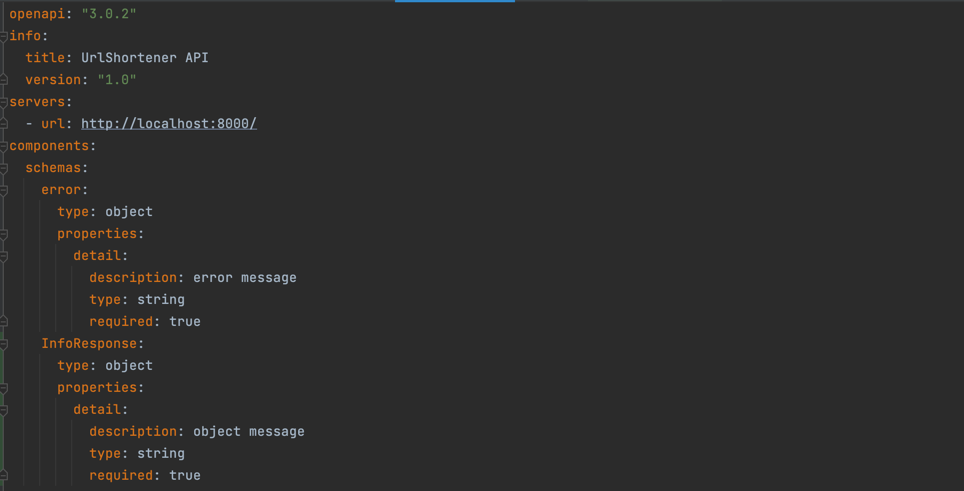
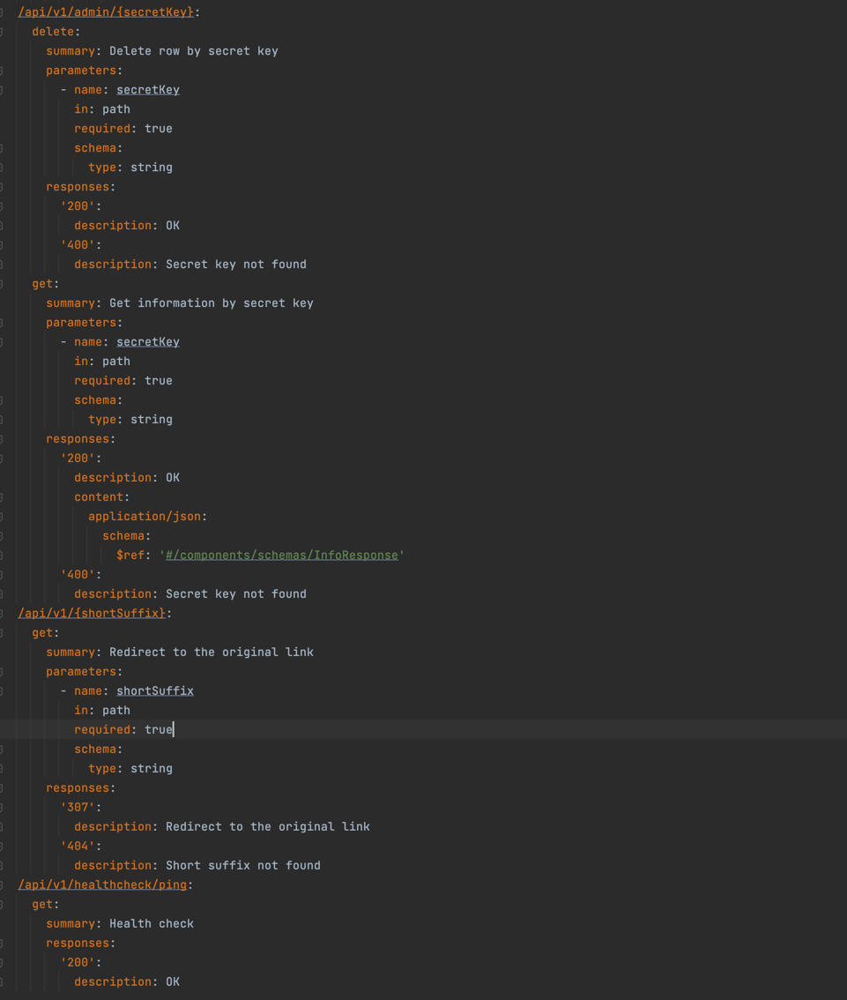

# Vip urls

## Идея
Идея проекта заключается в создании сервиса сокращения URL-адресов с возможностью предоставления VIP-ссылок. VIP-ссылки
позволяют пользователям создавать сокращенные ссылки, для более удобного использования и распространения, также позволяют
следить за количеством перехода по этим ссылкам.

## Продуктовые гипотезы
1. Если предоставлять ссылки с более удобным форматом VIP-ссылок, то ожидается, что пользователи будут чаще использовать
   эти ссылки, потому что Vip ссылки предоставляются в более коротком и запоминающемся формате, что облегчает пользователю
   запоминание и обмен ссылками.
2. Если отслеживать метрики со взаимодействием Vip-ссылок, то ожидается, что аналитики и маркетологи будут иметь больше
   информации о поведении пользователей и на основе этих данных смогут принимать более эффективные решения, потому что
   отслеживание метрик обеспечивает аналитическую осведомленность, что позволяет принимать информированные решения.

## Оценка трудозатрат (описывается с точки зрения учебного проекта)
1. **Анализ требований и проектирование**: оценивается на 3 часа работы, включая определение функциональных требований,
   перепроектирование БД и пересмотр архитектуры системы.
2. **Разработка серверной части**: оценивается на 10 часов работы, включая реализацию для хранения и управление ссылками
   в БД, а также реализацию доступа к VIP-ссылкам и отслеживания время жизни ссылки.
3. **Тестирование и отладка**: оценивается на 10 часов работы, включая проверку на краевые случаи и время на исправление
   выявленных ошибок

## Описание MVP
Придумать, можно ли сделать MVP, если да, то как он будет выглядеть и сколько это займет времени;
В качестве MVP, я думаю лучше будет использовать ботов в мессенджерах таких как телеграм или вк, которые будут подключены
к уже написанному бэкенду, благодаря тому, что будут использоваться мессенджеры, нет необходимости писать фронт-енд часть,
что экономит ресурсы при создании MVP. Главный ресурс-время, будет потрачено лишь на изучение API телеграмма или вконтакте,
для разработки ботов, что оценивается примерно в 30-40 часов рабочего времени.

## Описание архитектуры
Проработать архитектуру и описать ее в тексте (в качестве формального описания подойдут OpenAPI описание, диаграммы классов,
компонентные диаграммы и др. - в зависимости от того, что лучше отразит суть изменений и, что будет понятнее проверяющему);
> Структура ручек в OpenApi

> Метод Post, который сокращает ссылки

> Метод Delete для удаления ссылки по секретному ключу

> Метод Get для просмотра информации о ссылке

> Метод Get для перехода по Vip ссылке

> Метод Get для проверки работаспособности сервера

> Описание в api в формате openapi.yaml

## AB - тесты
Придумать AB-тест - какие выборки пользователей будут в эксперименте? Какие параметры фичи будем проверять в каждой выборке?
[1 - отсутствует описание, 2 - описан AB с флагом - включен или выключен эксп, 3 - описаны AB тесты, кроме контрольной есть
больше 1 выборки с параметрами конфигурации фичи, например, размер-цвет]
**Выборка пользователей:**
1. Контрольная выборка, которая будет использовать функционал сервиса без изменений, то есть использовать автоматически
   сгенерированные ссылки
2. Тестовая выборка, которая будет использовать новый функционал для сокращения ссылок и подсчета переходов.

Для проведения АВ-теста определим параметры фичи, которые будут проверяться в каждой выборке.
1. Количество переходов по ссылкам (для проверки как изменится количество переходов в тестовой выборке с использованием
   новой фичи по сравнению с контрольной выборкой без этой фичи)
2. Время, затраченное на переход по ссылке (для проверки, как изменится время, затраченное на переход по ссылке в
   тестовой выборке с использованием новой фичи по сравнению с контрольной выборкой без этой фичи)
3. Конверсия (для проверки, как изменится конверсия в тестовой выборке с использованием новой фичи по сравнению
   с контрольной выборкой без этой фичи)

## Описание метрик по которым можно сделать вывод, что фича взлетела. Какие значения метрик ожидаем увидеть?
Метрики:
1. Количество переходов по ссылкам: если новая фича увеличивает количество переходов по ссылкам, то можно сделать вывод,
   что она взлетела, фича будет считаться успешной, если метрики переходов по ссылке будут увеличены на более чем 5%.
2. Конверсия, если новая фича увеличивает конверсию, то она взлетела.